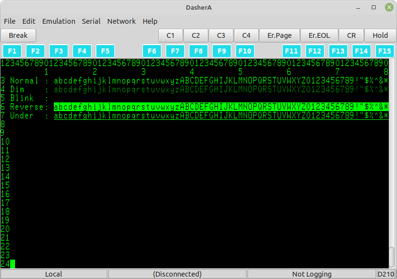

# DasherA
DasherA is a free terminal emulator for Data General DASHER series character-based terminals.

It is written in GNU Ada using the GtkAda toolkit and should run on all common platforms targeted by those tools.  Other platforms satisfying the build requirements (see below) may also work - eg. it builds and runs successfully on Raspbian GNU/Linux version 11 32-bit.




## Key Features

* DASHER D200 & D210 Emulation
* Serial interface support at 300, 1200, 2400, 9600, 19200 & 38400 baud, 7 or 8 data bits,
no/odd/even parity, 1 or 2 stop bits (defaults to DG-standard: 9600, 8, n, 1)
* BREAK key support for serial interface - permits use as master console
* Network Interface (Telnet) support
* May specify ```-host host:port``` on command line
* Reverse video, blinking, dim and underlined characters
* Pixel-for-pixel copy of D410 character set
* 15 (plus Ctrl & Shift) DASHER Function keys, Erase Page, Erase EOL, Hold, and Break keys
* C1, C2, C3 and C4 DASHER Custom keys (plus shifted versions)
* Loadable function-key templates (BROWSE, SED and SMI provided as examples)
* 2000-line terminal history
* Session logging to file
* Various terminal widths, heights and zoom-levels available
* Support for mini-Expect scripts to automate some tasks [see Wiki](https://github.com/SMerrony/DasherG/wiki/DasherG-Mini-Expect-Scripts)
* Paste from system Clipboard
* XMODEM-CRC file send and receive with short (128) or long (1024) packets
  
Here is the full [Implementation Chart](./Docs/implementationChart.md) for DasherA.

## Source
DasherA is [hosted on GitHub](https://github.com/SMerrony/dashera).

A binary version for 64-bit Debian-based systems *may* be available as part of a release.

I would love to be able to provide a Windows binary, but I don't have the required
facilities.  If anyone could help with this, please do get in touch.

## Build

### Alire

Dashera has moved to the [Alire](https://alire.ada.dev/) build system (but see below).

[](https://alire.ada.dev/crates/dashera.html)

Once you have Alire installed you should be able to obtain the latest release of Dashera and build it with just the three commands below...
```
alr get dashera
cd dashera
alr build
```
N.B. If you have not built a GtkAda crate (the GUI toolkit we use) recently then Alire will automatically download and build that before building Dashera itself.  This can take some time when it first happens, subsequent builds should be much faster.

### Non-Alire

If you cannot use Alire, it should still be possible to build Dashera with gprbuild... 
```
mkdir obj
gprbuild -Pnon_alire -Xmode=release
```
Ignore the warning about file name not matching project name.

Without Alire you will have to manually ensure that dependencies (eg. GtkAda) are installed.
Eg. You may need to install the `libgtkada20-dev` package.

## Run
`.bin/dashera`

```
Usage of dashera:
  -amber            Use an amber font instead of green
  -debug            Print debugging information on STDOUT
  -h or -help       Print this help
  -host <host:port> Host to connect with via Telnet
  -tracescript      Print trace of Mini-Expect script on STDOUT
  -tracexmodem      Show details of XMODEM file transfers on STDOUT
  -version          Show the version number of dashera and exit
  -white            Use a white font instead of green
```
You need the DASHER font and icon to be in the same directory as the executable (for now).

## Operational Notes
* The DASHER 'CR' (carriage-return, no line-feed) is available from both the GUI 'CR' button and the
numeric keypad enter key (if present).
* The DASHER keyboards had a 'DEL' key but no 'Backspace', Dashera treats both keys as a DASHER Delete (backwards)
* The BELL sound will only work if DasherA is started from a terminal supporting such an event, 
or if the windowing system permits Window Beeps.  In Mint 20+, the critical setting is
Accessibility => Keyboard => Event Feedback => Sound to use for window alerts.

